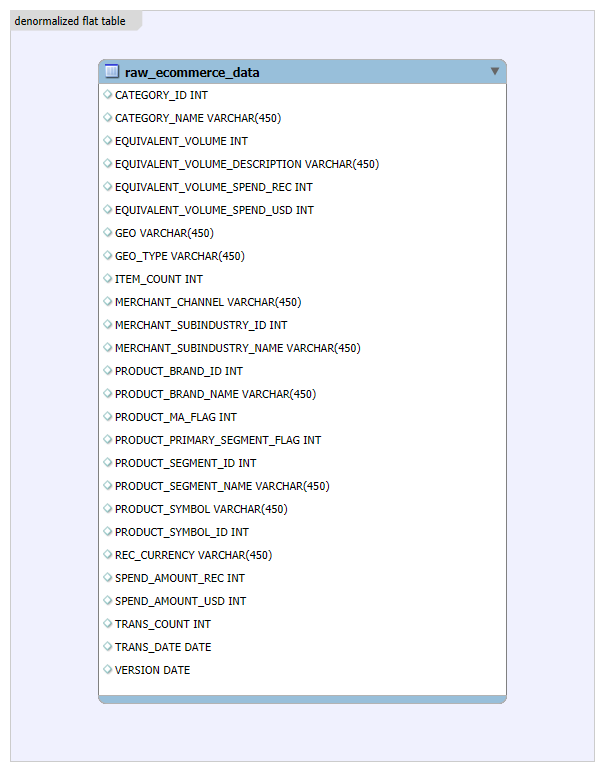
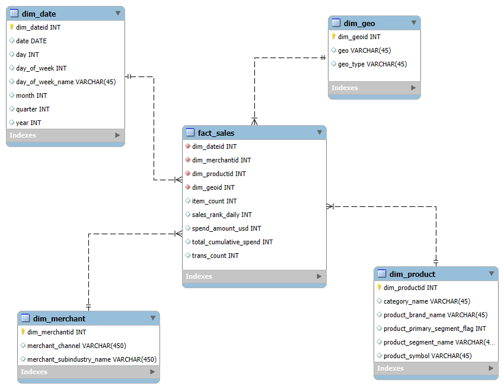
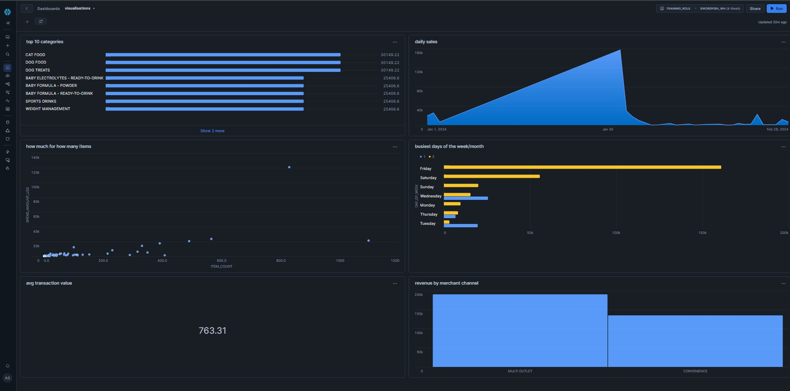

# **ELT PROCES DATASETU CONSUMER IN-STORE & E-COMMERCE RECEIPT TRANSACTIONS**

Tento repozitár predstavuje implementáciu **ELT procesu v snowflake** a návrh **dátového skladu so schémou star schema** založeného na dátach zo **snowflake marketplace**.

Projekt pracuje s datasetom:

**SWORDFISH_CONSUMER_INSTORE__ECOMMERCE_RECEIPT_TRANSACTION_DATA__CPG**

Cieľom projektu je analyzovať **spotrebiteľské nákupné správanie**, vývoj tržieb, produktové kategórie a geografické rozdiely v segmente **consumer packaged goods (CPG)**. Výsledný dátový model je optimalizovaný pre analytické dotazy a vizualizácie.

---

## **1. POPIS ZDROJOVÝCH DÁT**

Zdrojové dáta pochádzajú výhradne zo **snowflake marketplace**, čím je splnená povinná podmienka zadania. Dataset obsahuje agregované údaje o spotrebiteľských nákupoch v kamenných predajniach aj e-commerce prostredí.

Použitá databáza:
SWORDFISH_CONSUMER_INSTORE__ECOMMERCE_RECEIPT_TRANSACTION_DATA__CPG

Použitá tabuľka:
- **CE_BASKETVIEW_SIGNAL_CPG_GROWTH_DATA_SAMPLE**

Dataset obsahuje informácie o:
- produktoch (značka, kategória, segment),
- geografii (štát),
- obchodných kanáloch,
- dátume transakcie,
- výške výdavkov a počte položiek.

---

## **2. DÁTOVÁ ARCHITEKTÚRA (ERD)**

Pôvodné dáta sú uložené v jednej **denormalizovanej tabuľke**, ktorá kombinuje viaceré dátové domény (produkt, čas, geografia, obchodník).

<p align="center">
  
  <br>
  <em>Obrázok 1 – Pôvodná plochá dátová štruktúra</em>
</p>

---

## **3. DIMENZIONÁLNY MODEL (STAR SCHEMA)**

Na základe analýzy zdrojových dát bol navrhnutý **hviezdicový model (star schema)** podľa Kimballovej metodológie.

### **Dimenzie**
- **DIM_DATE** – časová dimenzia (deň, mesiac, rok, štvrťrok, deň v týždni), **SCD Type 0**
- **DIM_PRODUCT** – produktové informácie (značka, kategória, segment), **SCD Type 0**
- **DIM_GEO** – geografická dimenzia (štát, typ geografickej jednotky), **SCD Type 0**
- **DIM_MERCHANT** – obchodný kanál a subodvetvie, **SCD Type 0**

### **Faktová tabuľka**
- **FACT_SALES** – obsahuje metriky:
  - počet položiek,
  - počet transakcií,
  - výdavky v USD.

Vo faktovej tabuľke sú použité **window functions**:
- `rank()` – poradie dní podľa tržieb,
- `sum() over()` – kumulatívne tržby v čase.

<p align="center">
  
  <br>
  <em>Obrázok 2 – Dimenzionálny model (Star Schema)</em>
</p>

---

## **4. ELT PROCES V SNOWFLAKE**

Celý proces je realizovaný podľa princípu **ELT (extract – load – transform)** priamo v snowflake.

---

### **4.1 EXTRACT & LOAD**

Dáta sú extrahované zo snowflake marketplace a uložené do **staging vrstvy**.

```sql
create or replace database dwh_sales_project;
use database dwh_sales_project;

create or replace schema staging;

create or replace table staging.sales_staging as
select * from SWORDFISH_CONSUMER_INSTORE__ECOMMERCE_RECEIPT_TRANSACTION_DATA__CPG.SAMPLE_DATA.CE_BASKETVIEW_SIGNAL_CPG_GROWTH_DATA_SAMPLE;
```

### **4.2 TRANSFORM – DIMENZIE**

V transformačnej fáze boli dáta zo staging tabuľky očistené, deduplikované a rozdelené do samostatných dimenzií podľa princípov **Kimballovej metodológie**. Cieľom bolo oddeliť opisné atribúty (čas, produkt, geografia, obchodný kanál) od merateľných metrík a pripraviť stabilné dimenzie typu **SCD Type 0**.

DIM_DATE

Časová dimenzia poskytuje detailný pohľad na dátum transakcie a umožňuje analýzu tržieb podľa dní, mesiacov, rokov a dní v týždni.

```sql
create or replace table dim_date as 
select row_number() over (order by cast(trans_date as date)) as dim_dateid,
    cast(trans_date as date) as date,
    date_part(day, cast(trans_date as date)) as day,
    date_part(month, cast(trans_date as date)) as month,
    date_part(year, cast(trans_date as date)) as year,
    date_part(quarter, cast(trans_date as date)) as quarter,
    date_part(dow, cast(trans_date as date)) + 1 as day_of_week,
    case date_part(dow, cast(trans_date as date)) + 1
        when 1 then 'Monday'
        when 2 then 'Tuesday'
        when 3 then 'Wednesday'
        when 4 then 'Thursday'
        when 5 then 'Friday'
        when 6 then 'Saturday'
        when 7 then 'Sunday'
    end as day_of_week_name
from sales_staging
group by cast(trans_date as date)
order by date;
```

DIM_PRODUCT

Produktová dimenzia obsahuje informácie o produktoch, ich značkách, kategóriách a segmentoch. Táto dimenzia umožňuje analyzovať výkonnosť produktov a produktových kategórií.

```sql
create or replace table dim_product as
select
    row_number() over (order by product_symbol, product_brand_name, category_name) AS dim_productid,
    product_symbol,
    product_brand_name,
    category_name,
    product_segment_name,
    product_primary_segment_flag
from sales_staging
group by 
    product_symbol,
    product_brand_name,
    category_name,
    product_segment_name,
    product_primary_segment_flag
order by product_symbol;
```

DIM_GEO

Geografická dimenzia reprezentuje územnú príslušnosť transakcií a umožňuje porovnávať tržby medzi jednotlivými geografickými jednotkami.

```sql
create or replace table dim_geo as
select
    row_number() over (order by GEO, GEO_TYPE) as dim_geoid,
    geo,
    geo_type
from sales_staging
group by geo, geo_type
order by geo;
```

### **4.3 TRANSFORM – FAKTOVÁ TABUĽKA**

```sql
create or replace table fact_sales as
select
    s.item_count,
    s.trans_count,
    s.spend_amount_usd,
    d.dim_dateid,
    p.dim_productid,
    g.dim_geoid,
    m.dim_merchantid,
    rank() over (partition by d.dim_dateid order by s.spend_amount_usd desc) as sales_rank_daily,
    sum(s.spend_amount_usd) over (order by d.date rows between unbounded preceding and current row) as total_cumulative_spend
from sales_staging s
join dim_date d on cast(s.trans_date as date) = d.date
join dim_product p on s.product_symbol = p.product_symbol and s.product_brand_name = p.product_brand_name and s.category_name = p.category_name and s.product_segment_name = p.product_segment_name
join dim_geo g on s.geo = g.geo and s.geo_type = g.geo_type
join dim_merchant m on s.merchant_channel = m.merchant_channel and s.merchant_subindustry_name = m.merchant_subindustry_name;
```

### **5. VIZUALIZÁCIA DÁT**

Na základe dátového modelu bol vytvorený analytický dashboard obsahujúci 6 vizualizácií, napríklad:

- Top produktové kategórie podľa tržieb

  ```sql
  select 
      p.category_name, 
      sum(f.spend_amount_usd) as total_spend
  from fact_sales f
  join dim_product p on f.dim_productid = p.dim_productid
  where p.category_name is not null 
    and p.category_name not in ('Unknown', 'n/a', 'Other') 
  group by p.category_name
  order by total_spend desc 
  limit 10;
  ```

- Vývoj tržieb v čase

  ```sql
  select 
      d.date, 
      sum(f.spend_amount_usd) as daily_spend
  from fact_sales f
  join dim_date d on f.dim_dateid = d.dim_dateid
  group by d.date
  order by d.date;
  ```

- Najvýkonnejšie dni v týždni

  ```sql
  select
      d.day_of_week_name,
      d.month,
      sum(f.spend_amount_usd) as total_revenue
  from fact_sales f
  join dim_date d on f.dim_dateid = d.dim_dateid
  group by d.day_of_week_name, d.month
  order by sum(f.spend_amount_usd) desc;
  ```

- Tržby podľa obchodných kanálov

  ```sql
  select 
      m.merchant_channel, 
      sum(f.spend_amount_usd) as total_revenue
  from fact_sales f
  join dim_merchant m on f.dim_merchantid = m.dim_merchantid
  group by 1
  order by 2 desc;
  ```

- Priemerná hodnota nákupného košíka

  ```sql
  select 
      round(avg(spend_amount_usd), 2) as avg_basket_value
  from fact_sales;
  ```


<p align="center">  <br> <em>Obrázok 3 – Analytický dashboard</em> </p>
AUTOR

Anna Szabóová
